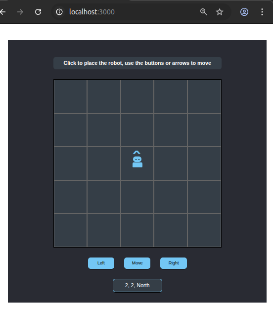

# Toy Robot Simulator V2

# Contents
[Architecture](#architecture-choices)

[Project Flow](#project-flow)

[Testing](#testing)

[Assumptions and Decisions](#assumptions-and-decisions)

[How to Set up and Run this Project](#how-to-set-up-and-this-project)

# Architecture

This project uses NestJS as the backend framework, SQlite as the database, and VueJS as the frontend framework.

# Project Flow

The Nest backend makes available an API endpoint at  `/api/positions` that the frontend app uses to find all historical positions and recover its last known state, as well as to save new position history in the database.

An additional action is accessible to delete all positions and clear out the history.  The simulator doesn't activate it, but `curl` can be used to access it to clear data during testing of the app.

See the API specification [here](/docs/api.md).

The frontend runs as a single page application that is served as static assets by Nest out of `/backend/public`.

The app consists of a main `App.vue` that is responsible for templates and importing Vue composables that give it the state and logic needed to initialize and run the simulator.

The frontend app was not refactored into sub components because its scope was such that the App.vue file is able to be easily understood and maintained in one file over splitting it up.

The main app needs to know nothing about the backend, as it deals with the usePositions composable that handles API calls for it.

Files are set up to favour separating responsibilities of each file, such as having `usePositions.ts` for database and API interaction and `useGame.ts` for game setup and execution logic.  Styles are handled entirely in dedicated css files where the styles follow a flow similar to the visual layout of the UI to keep it easy to navigate and work with. Intention was put into setting up class hooks so that JS and CSS didn't have to have mixed and hard-to-maintain knowledge about each other. They rely on class list hooks to co-ordinate appearances for each state, which also allows easier swapping out and changing of appearances later.

# Testing

There are unit tests and an e2e test on the backend, and there are some unit tests on the front end.  See below, or click [here for frontend](#run-tests-optional) and [here for backend](#run-tests-optional-1) for the commands to run them

The unit tests on the backend use a SQlite instance in RAM instead of a database mock, so the positions service is able to test against a real database.  It currently has a basic set of tests to ensure that it is able to function normally when given optimal inputs.

There is an e2e test on the Nest application that runs a cycle of its API endpoints to verify that they're working.  Because the positions controller does nothing more than to pass on execution to the positions service, no unit tests were created and the e2e test serves as indication that they are functioning.

Comments have been added into some of the spec files across the back end and front end to indicate other tests that I'd like to add.

There is generally a minimum level of test coverage and monitoring availability neededed before a feature or deliverable would be considered ready to ship.

Wherever not specified in these spec files, in general my testing preferences for a deliverable to be reliable is to have the happy path covered, and then to have deliberately thought of edge cases in input, potential malformed input, potential hostile input, error states and failure states, and protecting against regressions.  These can vary by situation, but these are the general patterns.

# Assumptions and Decisions

There were a few minor ambiguities that seemed to have sensible default choices, but which were noticeable did require choices to be made.

I wasn't able to do additional requirements gathering, so here is a series of places where I found uncertainties and what I decided to do with them:

## 1 -  Robot placement
One instruction said that clicking a new tile while the robot is already on one, would move the **original robot** to that position.  Another instruction later on says that clicking to place the robot on a new tile should **delete the old one from the UI**.

I took that to mean that clicking a tile should move the existing robot instance without leaving behind a duplicate UI visual of it that hasn't been cleaned up or deleted from view.  It will have the same UX with no apparent downsides.

But this note is being made to indicate that in case the designer preferred that the robot truly is deleted and reinstantiated on tile clicks.

## 2 - Report output
It was unclear whether the `Report` section on the UI was meant to be a button that when clicked shows another view that reports the current position, or whether it was meant to always show the current position as its text contents.

I made the assumption that the UX would be better to have it always shown, so that the area says "Report" when the robot is not on the board and then shows their position as "0, 0, North" when they are on the board.

## 3 - Output casing
In the instructions, the output examples show a mixture of using all uppercase or using one uppercase letter followed by lowercase for the directional information.  I tried using each in the app and it looked a little visually more pleasant to go with the first letter being uppercase only.

## 4 - Arrow design
In creating the arrow that is used to show the robot's directional orientation: I originally wondered if there was a unicode character that already existed for such a shape, but the closest thing I could find was a greater-than sign that I would rotate.

I took a close up look and noticed a difference where the design's arrow had a truly sharp point and the greater-than sign has a flat part on its tip.

I knew that I could create a pixel perfect arrow if I made two divs and rotated them and turned them into a composed shape, but the visual difference was so small that it makes it potentially not worth the extra code to write it.  I'm documenting this though in case it is imporant to go back and get that shape perfect.

## 5 - Yellow border on design image
The design image of the game board has a yellow border around it, but I think that is a result of how figmas highlight the boundaries of things and isn't meant that the game needs the same kind of border.

## 6 - Shadow under buttons
It was nearly imperceptible due to image compression but it appeared that there was a slight shadow of about 1px under the control buttons, so I decided to add that in.  It definitely appeared that these buttons had more shadow than the other elements and that it might have been intentional.

## 7 - Output spacing
Minor detail:  the output instructions show positions like '0,0,North' without spaces, but I have been displaying them with spaces as it is easier to read on the report output.

## 8 - Deviating from the design in one place
Deviation from the designs:  I didn't see anything indicating a hover state on the buttons, but as soon as I passed the mouse cursor over the buttons I could feel that they seemed to be missing something.  Adding a slight colour change on hover made the UX instantly feel a lot more fun and interactive.

## 9 - Decision about using nested components
Decision about nested reusable components in Vue: while it is advantageous to do this in some cases, it would have made the project unnecessarily complex as the App.vue file's template has no clutter and can be viewed and comprehended without having to jump elsewhere.

It also makes the game a little more maintainable in its current form because it's easier to get direct understanding of what each file is responsible for.

## 10 - Arrow keys for movement
Arrow keys for movement:  One might assume that the button click commands are 'turn left', 'turn right', 'move forward' but arrow keys might lend themselves to moving 'up', 'down', 'left', 'right', however it seemed to be intended that arrow keys would issue turn and move commands just like the buttons do.

So I used arrow left for turn left, arrow right for turn right, and up/down arrows both work to move forward in the direction being faced.

## 11 - Decision about unintentional Grid feature
The instructions are to make a 5x5 grid, and that the co-ordinates need to be 0,0 at the bottom left, and 4,4 at the top right.

This is different than the 'rows and columns' numbering of CSS Grid, and there didn't seem to be a quick way to reflow the grid to match it.

So I made logic in the useGame composable that could take in an integer input like 5, and produce an array of grid tiles that have their row, column, and corresponding x & y coorinates in one place.

This facilitated making the grid resizable as an unintended by product, so now as long as the custom-properties.css file and App.vue both have their respective 'grid size' variables kept manually in sync, the game will be able to show a 5x5 grid, and 10x10 and 100x100 have also been tested.

## 12 - Authentication
As mentioned in the API spec, normally sending HTTP requests with POST or DELETE that mutate data will need to have some kind of authentication middleware but it was out of scope for this project.

# How to Set up and this Project

## Step 1 - VueJS Frontend Setup

### Change to `frontend` directory

``` bash
# change to frontend folder
$ cd frontend          # (from project root)

# install dependencies
$ npm install
```

### Compile frontend as static assets

```bash
$ npm run build
```
Build artifacts will be placed automatically in `/backend/public`, where the NestJS server will serve them as static assets.

### Run tests (optional)

```bash
$ npm run test:unit
```

## Step 2 - NestJS Backend Setup

### Change to `backend` directory

``` bash
# change to backend folder
$ cd ../backend       # (from frontend)
-or-
$ cd backend          # (from project root)

# install dependencies
$ npm install
```

### Compile and run the project

```bash
# development
$ npm run start

# watch mode
$ npm run start:dev

# production mode
$ npm run start:prod
```

### Run tests (optional)

```bash
# unit tests
$ npm run test

# e2e tests
$ npm run test:e2e

# test coverage
$ npm run test:cov
```

## Step 3 - Point Browser to NestJS Server

Open a browser to localhost:3000 to use the playable app

Clicking the buttons shown will **turn left**, **turn right**, and **move** the robot forward.

The keyboard arrow keys also work in this way:

Left arrow -> Turn left

Right arrow -> Turn right

Up/Down arrow -> Move forward



Please enjoy!
